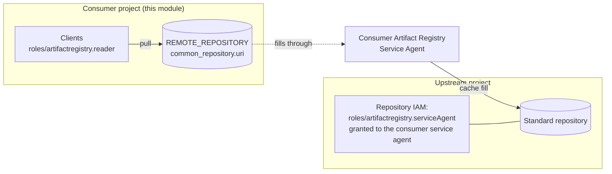

# Design

## Context

See `proposal.md` for motivation. This document records what the Artifact Registry API,
its documentation and the Google provider guarantee about an Artifact Registry upstream,
the module surface that follows, and what the documentation does not settle.

Every technical claim below is sourced. Claims that could not be verified at source are
marked as unverified rather than assumed.

### The model



Two grants live in two projects. A single module invocation owns one project, so it can
own the remote repository and the client grants on it, but not the cache-fill grant. That
grant is IAM on a repository in the upstream project, which is why the feature needs a
surface on the upstream side as well.

## Verified facts

| Fact                                                                                                                                                                                                                                                                                                                                             | Source                                                                                                                                                                    |
| ------------------------------------------------------------------------------------------------------------------------------------------------------------------------------------------------------------------------------------------------------------------------------------------------------------------------------------------------ | ------------------------------------------------------------------------------------------------------------------------------------------------------------------------- |
| `remote_repository_config.common_repository` is a member of the API union field `remote_source`, alongside `dockerRepository`, `mavenRepository`, `npmRepository`, `pythonRepository`, `aptRepository` and `yumRepository`. Exactly one may be set.                                                                                              | [REST reference, `RemoteRepositoryConfig`](https://docs.cloud.google.com/artifact-registry/docs/reference/rest/v1/projects.locations.repositories#RemoteRepositoryConfig) |
| `common_repository.uri` accepts three shapes: an Artifact Registry resource path `projects/UPSTREAM_PROJECT_ID/locations/REGION/repositories/UPSTREAM_REPOSITORY`, an Artifact Registry repository URL `https://REGION-docker.pkg.dev/UPSTREAM_PROJECT_ID/UPSTREAM_REPOSITORY`, or a plain registry URI such as `https://registry-1.docker.io`.  | [provider resource docs](https://registry.terraform.io/providers/hashicorp/google/latest/docs/resources/artifact_registry_repository)                                     |
| `docker_repository.custom_repository` is documented as `[Deprecated, please use commonRepository instead]`.                                                                                                                                                                                                                                      | same provider resource docs                                                                                                                                               |
| `common_repository` was added to `google_artifact_registry_repository` in provider **6.12.0** (2024-11-18), in the GA provider and not only in `google-beta`.                                                                                                                                                                                    | [provider CHANGELOG, 6.12.0, PR #20305](https://github.com/hashicorp/terraform-provider-google/blob/main/CHANGELOG.md)                                                    |
| A repository resource path cannot be passed through `custom_repository.uri`: the API answers `Custom remote repository URI must start with 'http://' or 'https://'`.                                                                                                                                                                             | [GoogleCloudPlatform/terraform-google-artifact-registry#46](https://github.com/GoogleCloudPlatform/terraform-google-artifact-registry/issues/46)                          |
| "Artifact Registry remote repositories use the Artifact Registry Service Agent to authenticate to Artifact Registry upstream repositories."                                                                                                                                                                                                      | [Create remote repositories](https://docs.cloud.google.com/artifact-registry/docs/repositories/remote-repo)                                                               |
| The grant on the upstream repository is `roles/artifactregistry.serviceAgent` to `serviceAccount:service-REMOTE_PROJECT_NUMBER@gcp-sa-artifactregistry.iam.gserviceaccount.com`, applied with `gcloud artifacts repositories add-iam-policy-binding UPSTREAM_REPOSITORY --location=LOCATION --project=UPSTREAM_PROJECT_ID`.                      | same page                                                                                                                                                                 |
| "If you want to set an Artifact Registry repository as your upstream, and it's in a different project than your remote repository, then you need to grant the service account for the remote repository project access to the upstream repository project **before creating the remote repository**."                                            | same page                                                                                                                                                                 |
| "Artifact Registry upstream repositories must be standard mode repositories."                                                                                                                                                                                                                                                                    | same page                                                                                                                                                                 |
| Artifact Registry upstreams are supported for the Docker, npm, Maven and Python formats.                                                                                                                                                                                                                                                         | [Remote repositories overview](https://docs.cloud.google.com/artifact-registry/docs/repositories/remote-overview)                                                         |
| The service agent is `service-PROJECT-NUMBER@gcp-sa-artifactregistry.iam.gserviceaccount.com`. It is created automatically after the first repository is created in the project, and can be created on demand with `gcloud beta services identity create --service=artifactregistry.googleapis.com --project=PROJECT-ID`.                        | [Artifact Registry Service Agent](https://docs.cloud.google.com/artifact-registry/docs/ar-service-account)                                                                |
| `roles/artifactregistry.serviceAgent` contains `pubsub.topics.publish`, `artifactregistry.repositories.downloadArtifacts`, `artifactregistry.repositories.get`, `artifactregistry.repositories.readViaVirtualRepository` and `artifactregistry.versions.delete`.                                                                                 | same page                                                                                                                                                                 |
| Artifact Registry pulls are `DATA_READ` Data Access audit logs (`Docker-GetManifest`, `Docker-HeadManifest`, `Docker-ServeBlob`, `Docker-GetTags`, `Docker-Catalog`); pushes are `DATA_WRITE`. There is no remote-repository-specific operation, and the only upstream-authentication operation named is `VirtualRepo-Auth`, itself `DATA_READ`. | [Artifact Registry audit logging](https://docs.cloud.google.com/artifact-registry/docs/audit-logging)                                                                     |
| `disable_upstream_validation` is "Input only. A create/update remote repo option to avoid making a HEAD/GET request to validate a remote repo and any supplied upstream credentials."                                                                                                                                                            | REST reference, `RemoteRepositoryConfig`                                                                                                                                  |

Not settled by the documentation consulted:

- **Whether a remote repository and its Artifact Registry upstream may sit in different
  regions.** The virtual repository documentation states the constraint explicitly ("An
  upstream repository must be in the same location as the virtual repository, but can be
  in a different Google Cloud project"). The remote repository documentation makes no
  equivalent statement in either direction. Cross-region is therefore unproven, neither
  documented as supported nor as forbidden. This does not affect the module surface, which
  already takes `location` per repository, but it is worth a consumer-side check for a
  given region pair.
- **Whether a narrower custom role can replace `roles/artifactregistry.serviceAgent` on
  the upstream repository.** The documentation offers a custom-role alternative only for
  virtual repositories, built on `artifactregistry.repositories.readViaVirtualRepository`.
  For remote repositories it prescribes the service agent role and mentions no
  alternative.

## Permission model for a cross-project upstream

The consumer project's Artifact Registry Service Agent authenticates to the upstream, and
the upstream repository's owner grants it `roles/artifactregistry.serviceAgent` on that
repository.

`roles/artifactregistry.reader` is not the right role here. Reader, and the custom role
built on `artifactregistry.repositories.readViaVirtualRepository`, belong to the **virtual**
repository model. A remote repository with an Artifact Registry upstream uses the service
agent role.

That role is not read-only: it includes `artifactregistry.versions.delete`. Granting it
gives the consumer project's service agent the ability to delete versions in the upstream
repository, so the binding belongs at repository scope and never at project scope. The
`service_agents` field is deliberately per-repository for that reason, and the module
documents the privilege where the field is declared.

Because the documentation requires the grant to exist before the remote repository is
created, and because repository creation performs a HEAD/GET validation of the upstream
unless `disable_upstream_validation` is set, a consumer that applies ahead of the upstream
owner's grant fails at create time. Both halves of that ordering are documented in the
capability spec, and `disable_upstream_validation` is exposed so a consumer can choose to
skip the check rather than wait.

Observing that the fill really happens under the service agent requires Data Access audit
logs of type `DATA_READ` on `artifactregistry.googleapis.com` in the **upstream** project.
`DATA_WRITE` logs pushes into a repository, not cache-fill reads out of it. There is no
remote-repository-specific audit operation, so the evidence is ordinary read operations
whose `protoPayload.authenticationInfo.principalEmail` is the consumer project's service
agent.

## Module boundary

The module is single-project by construction: one `var.project_id`, one implicit provider,
and every resource in that project. Managing the cache-fill grant from the consumer's
invocation would require the consumer's Terraform identity to hold
`artifactregistry.repositories.setIamPolicy` on a registry owned by someone else, which
inverts the ownership of the upstream and makes every client project an administrator of
it.

The boundary:

- **Consumer invocation:** the remote repository and the in-project client grants on it.
- **Upstream owner's invocation:** the `roles/artifactregistry.serviceAgent` grant,
  expressed with `service_agents` on the upstream repository.
- **Neither:** any cross-project IAM resource inside a single module invocation.

The module supports the handoff between the two with an output carrying the consumer
project's service agent member string, so the value handed to the upstream owner is
generated rather than assembled from a project number by hand.

## Service agent identity

The service agent exists once the Artifact Registry API is enabled and the first
repository has been created in the project. The module already enables the API
(`google_project_service.project`, gated on `var.enable_api`) and creates repositories, so
in any project that uses this module the agent exists by the time a remote repository is
created.

The module does not create the identity. Doing so would mean
`google_project_service_identity`, which the provider documents as beta only ("These
resources are in beta, and should be used with the terraform-provider-google-beta
provider",
[provider docs](https://registry.terraform.io/providers/hashicorp/google/latest/docs/resources/project_service_identity)).
The module declares only `hashicorp/google`, so adopting it would add a `google-beta`
requirement to every consumer in order to create a resource that is a no-op wherever the
module has already created a repository. The documented manual escape hatch, if the agent
is ever missing, is
`gcloud beta services identity create --service=artifactregistry.googleapis.com --project=PROJECT-ID`.

The member string is derived from the project number instead:
`data "google_project"` returns `number`, and the member is
`serviceAccount:service-<number>@gcp-sa-artifactregistry.iam.gserviceaccount.com`. The
data source is gated so consumers that use none of the new fields do not acquire a new
`resourcemanager.projects.get` dependency.

## Decisions

1. **A separate `remote_repository_config_common` field, not a new attribute on
   `remote_repository_config_docker`.** The API models these as members of one union
   (`remote_source`), and `common_repository` is format-agnostic while the existing object
   is Docker-shaped and Docker-named. A separate field mirrors the union, leaves the
   existing object's type untouched, and immediately covers npm, Maven and Python
   Artifact Registry upstreams that the module cannot express at all today.
   Rejected alternative: add `common_repository_uri` to the docker object and relax
   `custom_repository_uri` to optional. It is a smaller diff here and a larger one in every
   consumer that declares its own copy of the type, it would let a docker configuration
   type-check with no URI at all, and it would name an Artifact Registry upstream inside a
   field called `_docker`.

2. **The module never manages IAM in a project other than `var.project_id`.** Reasoning in
   "Module boundary" above.

3. **`service_agents` is a named list per role, consistent with `readers` and `writers`.**
   A generic `iam_members = [{ role, member }]` field would be more flexible and would
   break the module's existing naming convention; there are exactly three roles the module
   needs to express.

4. **The service agent member is an output, and the `google_project` data source that
   backs it is gated.** It is created only when at least one repository uses
   `remote_repository_config_common`, and the output is `null` otherwise. A consumer that
   wants the member string without using the feature can compute it from its own project
   number; the module is not a registry of project numbers.

5. **Validation stays at plan time on `var.repositories`.** The existing
   `REMOTE_REPOSITORY` rule becomes a single exactly-one rule naming both fields, so the
   error arrives before the provider does, consistent with the module's other validations.

6. **No provider constraint change.** `common_repository` is available from
   `hashicorp/google` 6.12.0 and the module requires `>= 6.15.0`, so the floor already
   covers it and consumers need no `terraform init -upgrade`.

7. **`disable_upstream_validation` is exposed on the common configuration**, default
   `false`, matching the docker object. The documented ordering (grant before creation)
   means create-time upstream validation can fail for reasons outside the consumer's
   project, so consumers need the same escape hatch they already have on the docker path.

8. **Cleanup policy behaviour is unchanged.** The module applies its default cleanup
   policies to every repository unless `cleanup_policies_enable_default = false`, remote
   repositories included, and this change does not touch that. It does document the
   consequence for a pull-through cache: a policy that evicts a cached version which the
   upstream has meanwhile deleted makes that version unrecoverable, so
   `cleanup_policies_enable_default = false` is the safer setting for a cache whose
   consumers pin digests.

9. **The prerequisite documentation lives in `README.md`, not in the variable
   description.** The `repositories` variable already renders a very large type into the
   terraform-docs inputs table, and a multi-paragraph description made that row
   unreadable. The variable description carries the short form (the exactly-one rule, the
   two configurations, the standard-mode requirement, the existence of the grant) and
   points at a hand-written "Remote repositories" section above the terraform-docs marker,
   which holds the accepted `uri` shapes, the `gcloud` grant command, the privilege
   warning and the cleanup-policy caveat.

10. **`.terraform.lock.hcl` is git-ignored.** Running the new tests requires
    `terraform init`, which writes a lock file. Committing it in a module would both pin a
    provider version for a repository that intentionally declares only a floor, and feed
    that resolved version into the terraform-docs providers table, so the generated README
    would report whichever version the last local `init` happened to resolve.

11. **`service_agents` validates the member shape, breaking symmetry with `readers` and
    `writers` on purpose.** Those two accept any IAM member string, which is right for
    roles whose worst case is unintended read or write access inside one repository.
    `roles/artifactregistry.serviceAgent` also carries `artifactregistry.versions.delete`,
    and it has exactly one legitimate grantee: the Artifact Registry service agent of the
    consumer project. There is no valid reason to put a user, a group, or a user-managed
    service account in that list, so a value that is not
    `serviceAccount:service-<digits>@gcp-sa-artifactregistry.iam.gserviceaccount.com` is a
    privilege mistake, not a preference. Consistency loses to blast radius here.
    The cost is stated rather than hidden: if Google ever changes the service agent's
    address shape, a legitimate configuration is blocked until a new module release
    relaxes the pattern. That is recoverable, and the failure is a clear plan-time error
    rather than a silent over-grant.

12. **A remote configuration outside `REMOTE_REPOSITORY` mode is an error, not a no-op.**
    The rendering already ignores it, which means a repository could be written as a cache
    and created as a plain repository with no signal. Validation rejects the combination,
    and the `google_project` data source is gated on the same predicate the rendering uses,
    mode included, so the service agent member output cannot be populated for a repository
    that is not a cache. The same rule is applied to the pre-existing
    `remote_repository_config_docker` for symmetry: no repository in the fleet sets a
    docker remote configuration outside `REMOTE_REPOSITORY` mode, so nothing regresses.

13. **The CI gate does not pin the provider version.** The module declares
    `google >= 6.15.0` with no upper bound, so letting CI resolve the newest matching
    provider is the only signal that the declared contract still holds. Pinning would keep
    the gate green while the module shipped a claim it no longer honours. A provider major
    that breaks the tests is information worth having, and the test run is reproducible
    from the failure output. The stronger version of this idea is a matrix over both ends
    of the declared range, the floor and the latest, which is worth doing separately: it
    needs a per-run version constraint override rather than a pin, and it belongs to a
    CI change rather than to this feature.

## Backwards compatibility

- `custom_repository_uri` remains a required attribute of
  `remote_repository_config_docker`.
- With neither new field set, the rendered resource arguments are identical to before,
  including the `DOCKER_HUB` branch, the `custom_repository` branch, the
  `upstream_credentials` block, and the existing fallback where an empty
  `remote_repository_config.description` takes the repository's own description
  (`main.tf:198`).
- `service_agents` defaults to `[]`, so the IAM member map is unchanged for existing
  configurations. Its key already contains the role
  (`"<repository>--<role>--<member>"`, `main.tf:110`), so a third role introduces no key
  collisions and no address churn on existing bindings.
- The gated `google_project` data source is not evaluated for consumers that use none of
  the new fields.
- A consumer that declares its own copy of the `repositories` object type must add the new
  fields to that copy before it can pass them. Nothing breaks until it does.

## Testing

The module's existing quality gate is TFLint run against `examples/test.tfvars`
(`Makefile`, `.github/workflows/tflint.yaml`, and the `varfile` in `.tflint.hcl`), with
`tfsec` and `terraform-docs` as local targets. There are no tests. Two tiers follow from
that.

**Tier 1, matching existing practice.** Extend `examples/test.tfvars` with a remote
repository whose upstream is an Artifact Registry resource path and a standard repository
carrying a `service_agents` grant, then keep `make lint` and `make tfsec` green and
regenerate `README.md` with `make generate-docs`. This exercises type checking, the
variable validations and TFLint's view of the new dynamic block. It does not prove what the
provider renders.

**Tier 2, added by this change.** A `tests/` directory with native `terraform test` files
using `mock_provider "google"` and `command = plan`, plus a CI job. Mocked plan-time tests
need no credentials and no cloud resources, and they are the only way to assert the three
things Tier 1 cannot:

- a repository with `remote_repository_config_common` plans a `common_repository` block
  with the given `uri` and no `docker_repository` block;
- a repository with `remote_repository_config_docker` plans exactly what it plans today,
  including the `DOCKER_HUB` special case, which is the backwards-compatibility assertion;
- both new validation failures, asserted with `expect_failures`: a `REMOTE_REPOSITORY`
  with both configurations, and one with neither.

`terraform test` requires Terraform >= 1.6 and `mock_provider` requires >= 1.7, in CI
only. Test files are not consumed by module users, so `required_version = ">= 1.3"` does
not move.

## Reference implementation sketch

Recorded so review can argue with the shape rather than infer it. Not final code.

```hcl
# variables.tf, inside the repositories object type
remote_repository_config_common = optional(object({
  description                 = optional(string, "")
  uri                         = string
  disable_upstream_validation = optional(bool, false)
}), null)
service_agents = optional(list(string), [])
```

```hcl
# variables.tf, replacing the current REMOTE_REPOSITORY validation
validation {
  condition = alltrue([
    for repo in var.repositories : repo.mode != "REMOTE_REPOSITORY" ? true : (
      (repo.remote_repository_config_docker != null ? 1 : 0) +
      (repo.remote_repository_config_common != null ? 1 : 0)
    ) == 1
  ])
  error_message = "A repository in REMOTE_REPOSITORY mode must set exactly one of remote_repository_config_docker or remote_repository_config_common."
}
```

```hcl
# main.tf, inside resource "google_artifact_registry_repository" "repositories"
dynamic "remote_repository_config" {
  for_each = each.value.mode == "REMOTE_REPOSITORY" && each.value.remote_repository_config_common != null ? [each.value.remote_repository_config_common] : []

  content {
    description = remote_repository_config.value.description == "" ? each.value.description : remote_repository_config.value.description

    common_repository {
      uri = remote_repository_config.value.uri
    }

    disable_upstream_validation = remote_repository_config.value.disable_upstream_validation
  }
}
```

The existing docker `remote_repository_config` block gains the matching guard
(`each.value.remote_repository_config_docker != null`), so the two dynamic blocks are
mutually exclusive at render time as well as at validation time.

```hcl
# consumer usage: a cache of an upstream in another project
"upstream-cache" = {
  description = "Pull-through cache of an upstream Artifact Registry repository"
  format      = "DOCKER"
  mode        = "REMOTE_REPOSITORY"
  location    = "europe-west1"
  remote_repository_config_common = {
    uri = "projects/UPSTREAM_PROJECT_ID/locations/europe-west1/repositories/UPSTREAM_REPOSITORY"
  }
  cleanup_policies_enable_default = false
}
```

```hcl
# upstream owner usage: allow a consumer project's cache to fill from this repository
"shared-artifacts" = {
  description = "Shared artifacts repository"
  service_agents = [
    "serviceAccount:service-CONSUMER_PROJECT_NUMBER@gcp-sa-artifactregistry.iam.gserviceaccount.com",
  ]
}
```

## Exit criterion

1. `remote_repository_config_common` renders `common_repository` and nothing else, and the
   docker path renders exactly what it renders today.
2. Both new validations fail on the intended inputs and pass on the intended ones.
3. `service_agents` produces `google_artifact_registry_repository_iam_member` bindings with
   `roles/artifactregistry.serviceAgent`, with no address churn on existing bindings.
4. The service agent member output is correct for a project that uses the feature and
   `null` for one that does not.
5. `make lint`, `make tfsec` and the terraform-docs regeneration are green, and the
   example covers both new fields.
6. Released as `0.16.0`, with a CHANGELOG entry stating that a consumer which declares its
   own copy of the `repositories` object type must mirror the new fields.
